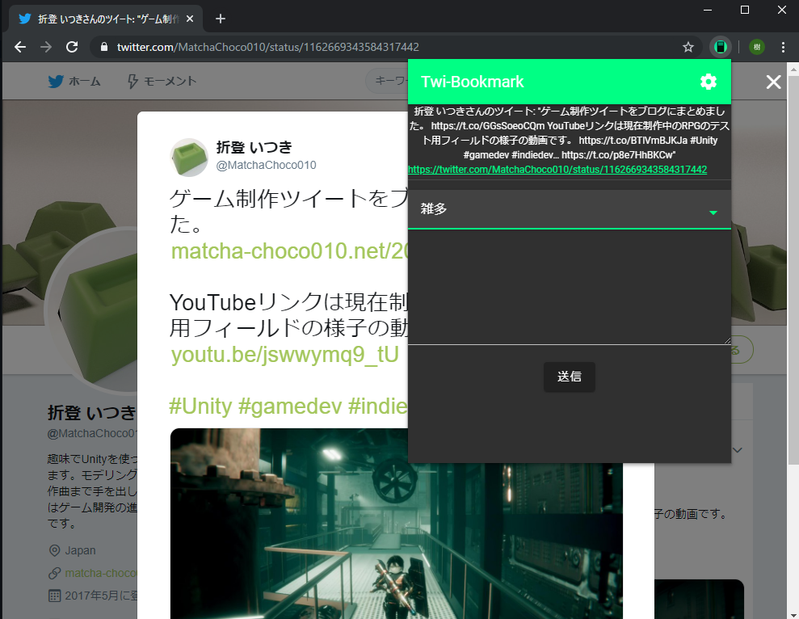
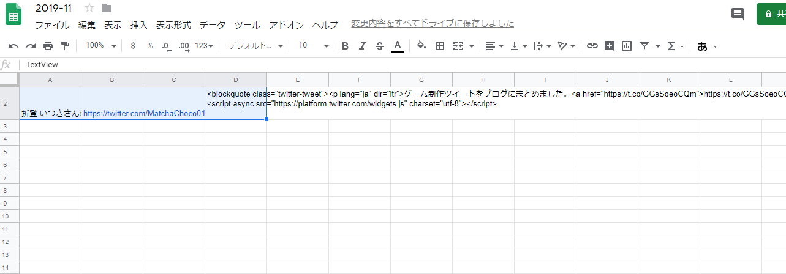
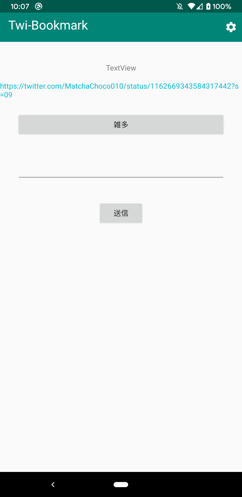
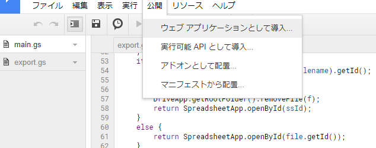
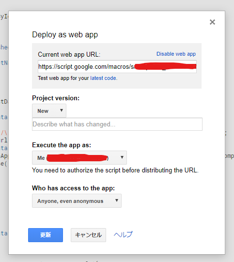
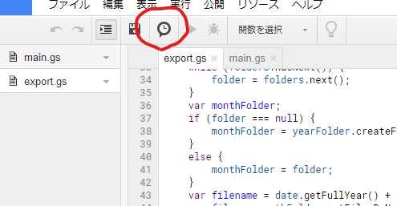
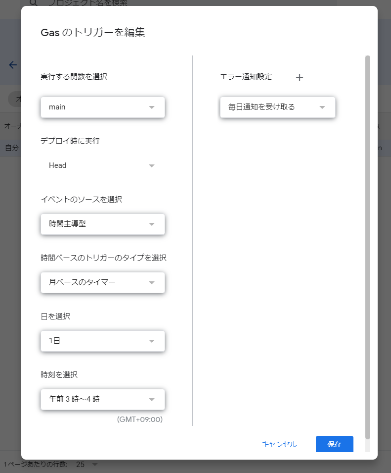
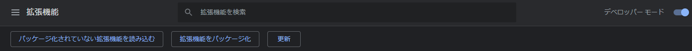
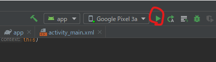
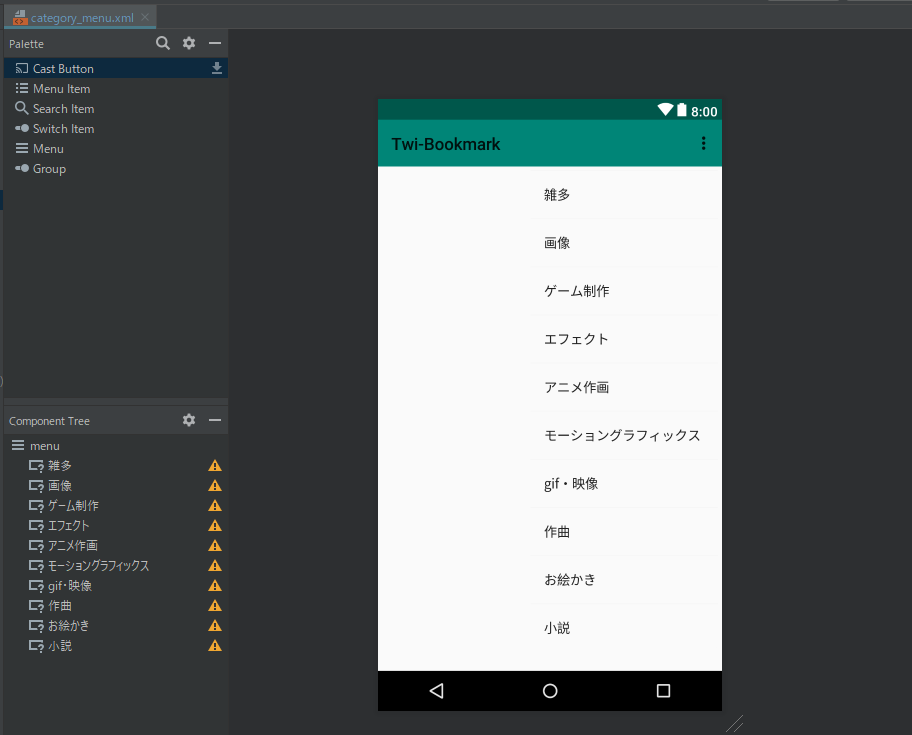

# twi-bookmark


## これはなに

ツイートの埋め込みコードをmarkdownファイルに纏めるためのツールです。

公式のいいね機能ブックマーク機能は、過去に遡るのが大変でかつカテゴリ分けなどができないことから
このプログラムが作成されました。

このプログラムはGoogle Apps Script、Webextensions、Android Appで構成されています。

## 使い方

### Webextensions

ツイートの個別ページで拡張機能のボタンをクリックします。



カテゴリを指定し、任意でコメントを追加して送信ボタンをクリックします。

Google Drive上に`Twi-Bookmark/YYYY/MM/YYYY-MM`というスプレッドシートが作成され、
カテゴリのシートの末尾に埋め込みコードやコメントが記録されます。



スプレッドシートに書き込まれた情報は月に一度markdownファイルに書き出されます。

### Android App

ブラウザ及びTwitterの「共有」からTwi-Bookmarkを起動します。



カテゴリを指定し、任意でコメントを追加して送信ボタンをクリックします。

Google Drive上に`Twi-Bookmark/YYYY/MM/YYYY-MM`というスプレッドシートが作成され、
カテゴリのシートの末尾に埋め込みコードやコメントが記録されます。


スプレッドシートに書き込まれた情報は月に一度markdownファイルに書き出されます。

## インストール方法

リポジトリをクローンします。

```
git clone https://github.com/MatchaChoco010/twi-bookmark.git
```

### Google Apps Script

claspをインストールします。

```
npm install -g @google/clasp
```

次のコマンドでログインします。

```
clasp login
```

次のコマンドでプロジェクトを作成します。

```
clasp create twi-bookmark
```

`gas/export.ts`と`gas/main.ts`をクローンしたリポジトリからプロジェクトフォルダにコピーします。

次のコマンドを実行しプロジェクトをアップロードします。

```
clasp push
```

アップロードしたプロジェクトを開き、`main.gs`で「公開>ウェブアプリケーションとして導入」をクリックします。



「Execute the app as:」を「Me」に、「Who has access to the app:」を「Anyone, even anonymous」に設定し保存します。



APIのURL`https://script.google.com/macros/s/******`をメモしておきます。

ここまででSpreadsheetにURLなどを書き込むスクリプトが`https://script.google.com/macros/s/******`でAPIとして公開されました。

次に`export.gs`の`main`関数を定期実行するように設定します。

タイマーアイコンをクリックします。



トリガーを追加し、月ベースのタイマーで`main`関数を実行するよう設定します。



これでGoogle Apps Scriptの設定は完了です。

### Webextensions

次にブラウザの拡張機能をインストールする手順を示します。

次のコマンドを実行します。

```
cd <repository-root>/web-extension
npm install
npm run build
```

拡張機能のページからデベロッパーモードを有効にし、「パッケージ化されていない拡張機能を読み込む」から`web-extension/dist/`をしていします。



インストールが完了します。


オプション画面を開いて、オプションのAPI URLの欄にメモしたURLを貼り付けます。

### Android App

`android-app/`をAndroid Studioで開きます。

デバイスを接続し実行してインストールします。



オプション画面を開いて、オプションのAPI URLの欄にメモしたURLを貼り付けます。

## その他

### カテゴリを編集するには

#### Webextensions

`web-extension/src/popup/App.vue`の以下の部分を編集します。

``` typescript
export default Vue.extend({
  name: 'App',
  data: () => ({
    dropdown_categories: [
      '雑多',
      '作曲',
      '小説',
      'ゲーム制作',
      'エフェクト',
      'モーショングラフィックス',
      'アニメ作画',
      '画像',
      'gif・映像',
      'お絵かき'
    ],
    title: '',
    url: '',
    category: '',
    comment: '',
    loading: false,
    dialog: false,
    error_message: ''
  }),
  ...
```

#### Android App

`res/menu/category_menu.xml`を編集します。


